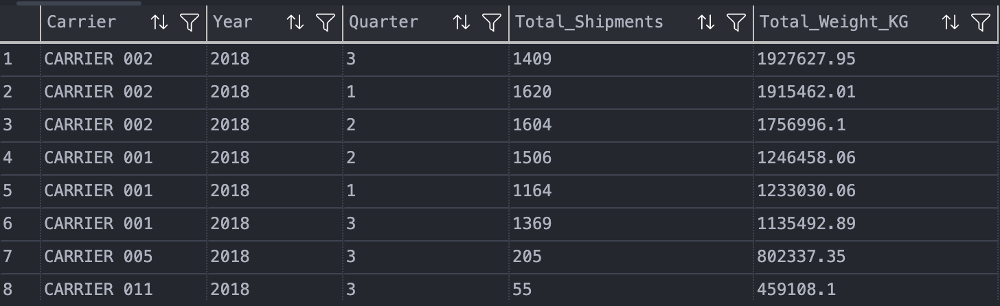
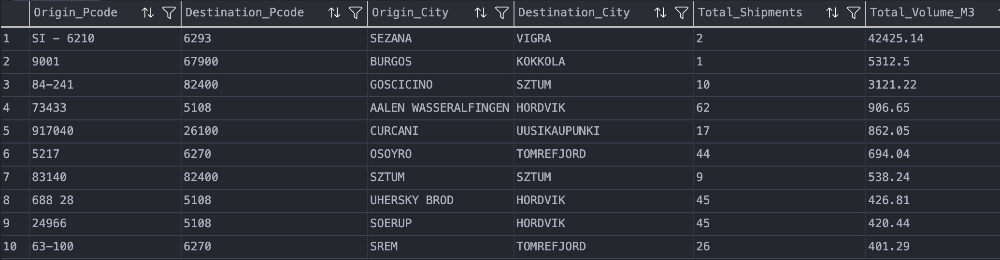
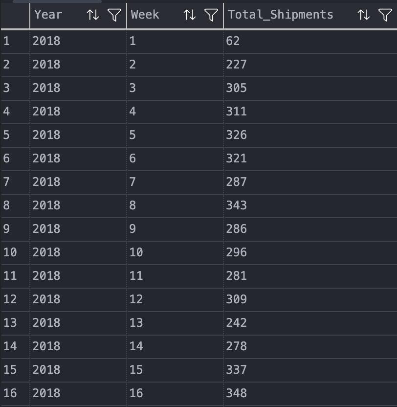
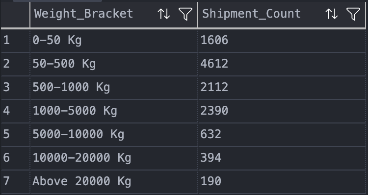
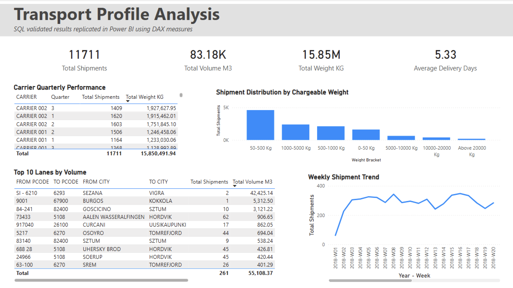

# Análisis de Perfil de Transporte

---

## Descripción del proyecto

Este proyecto corresponde a una prueba técnica de análisis de datos sobre un dataset de transporte.

El objetivo fue analizar la información disponible para obtener una visión general del perfil de envíos, identificando carriers principales, tiempos de entrega, lanes con mayor volumen, tendencias semanales y distribución de shipments por peso facturable.

El análisis fue realizado utilizando SQL Server para resolver y validar las consultas solicitadas, y Power BI Desktop para construir un reporte visual utilizando el dataset importado y medidas DAX. 

---

## Herramientas utilizadas

- SQL Server
- Power BI Desktop
- Excel / CSV
- GitHub
  
---

## Objetivos del análisis

Se desarrollaron consultas SQL para responder las siguientes consignas:

1. Obtener la cantidad total de shipments por trimestre, agrupados por carrier y ordenados por peso.
2. Calcular el promedio de días transcurridos entre la fecha de recogida y la fecha de entrega.
3. Identificar los lanes con mayor volumen.
4. Analizar la frecuencia de shipments y su tendencia semanal.
5. Clasificar los shipments por rangos de peso facturable.

---

## Consultas SQL

Las consultas utilizadas se encuentran en el archivo:

```text
sql/queries.sql
```

El dataset fue cargado en SQL Server en una tabla llamada:

```sql
dbo.Details
```

## Resultados SQL

### 1. Shipments por trimestre, carrier y peso total

Esta consulta agrupa los shipments por carrier, año y trimestre. Luego ordena el resultado según el peso total transportado.

<p align="center">
  
</p>

### 2. Promedio de días entre recogida y entrega

Esta consulta calcula el promedio de días entre la fecha de recogida y la fecha de entrega.

<p align="center">
  
</p>

### 3. Lanes con mayor volumen

Esta consulta identifica los lanes principales, definidos como combinación entre código postal de origen y código postal de destino.

<p align="center">
  
</p>

Durante el análisis se observaron algunos valores de volumen inusualmente altos (los tres primeros registros), por lo que sería recomendable validarlos con la fuente original antes de tomar decisiones finales. Ademas, se identificaron valores negativos muy grandes que pueden identificarse como outliers. 

### 4. Tendencia semanal de shipments

Esta consulta agrupa la cantidad de shipments por año y semana para observar la frecuencia de envíos a lo largo del tiempo.

<p align="center">
  
</p>

La evolución completa se presenta visualmente en la página Weekly Trends del reporte de Power BI.

### 5. Distribución por peso facturable

Esta consulta clasifica los shipments según los rangos de peso facturable definidos en la consigna.

<p align="center">
  
</p>

---

## Reporte en Power BI

El archivo de Power BI se encuentra en:

```text
powerbi/prueba_tecnica.pbix
```

El reporte fue desarrollado en **Power BI Desktop en modo Import**, por lo que los datos quedan incluidos dentro del archivo `.pbix`.

Esto permite abrir y revisar el reporte sin necesidad de conectarse a mi instancia local de SQL Server ni utilizar credenciales externas.

Para construir el reporte, se importó el dataset original en Power BI y se crearon medidas y columnas calculadas para replicar los mismos criterios utilizados en las consultas SQL.

Las consultas SQL fueron utilizadas para resolver y validar las consignas, mientras que Power BI fue utilizado para presentar los resultados de forma visual en una única página resumen.

---

## Modelo y cálculos en Power BI

Dentro de Power BI se crearon medidas DAX para calcular los principales indicadores del análisis:

```DAX
Total Shipments = DISTINCTCOUNT(Table1[SHIPMENT ID])
```

```DAX
Total Weight KG = SUM(Table1[WEIGHT (KG)])
```

```DAX
Total Volume M3 = SUM(Table1[VOLUME (M3)])
```

```DAX
Average Delivery Days = AVERAGE(Table1[Fecha de Delivery])
```

Además, se crearon columnas auxiliares en Power Query para facilitar el análisis temporal, la segmentación por lanes y la clasificación por peso facturable, incluyendo:

- Fecha de Delivery
- Año
- Quarter
- Semana
- Año Semana
- Lane
- Lane Detail
- Weight Bracket
- Weight Bracket Order

Estas columnas permitieron reproducir en Power BI los mismos criterios utilizados en SQL Server y construir los visuales principales del dashboard.

---

## Dashboard en Power BI

El reporte final fue concentrado en una única página llamada **Transport Profile Analysis**.

La página incluye los principales resultados de las cinco consignas solicitadas:

- Total de shipments.
- Volumen total transportado.
- Peso total transportado.
- Promedio de días entre recogida y entrega.
- Performance trimestral por carrier.
- Top 10 lanes por volumen.
- Distribución de shipments por rango de peso facturable.
- Tendencia semanal de shipments.

<p align="center">
  
</p>

El diseño fue realizado en una única página para facilitar la revisión rápida del análisis y permitir una lectura ejecutiva de los resultados principales.

---

## Principales resultados

A partir del análisis realizado, se pueden destacar los siguientes puntos:

- La actividad de transporte se concentra principalmente en determinados carriers.
- CARRIER 002 y CARRIER 001 concentran una parte importante del peso transportado.
- El promedio de días entre recogida y entrega es de aproximadamente 5.33 días.
- Existen lanes con volúmenes significativamente superiores al resto.
- La frecuencia semanal muestra variaciones en la actividad a lo largo del período analizado.
- La mayor parte de los shipments se concentra en los rangos de 50-500 Kg y 1000-5000 Kg de peso facturable.

---

## Observaciones sobre calidad de datos

Durante el análisis se identificaron algunos puntos a tener en cuenta:

- Algunas columnas numéricas fueron importadas como texto.
- Existen valores vacíos o faltantes en algunos campos.
- Se detectaron algunos valores de volumen negativos o inusualmente altos.
- Algunos Shipment ID aparecen en más de una fila, por lo que se utilizó `COUNT(DISTINCT SHIPMENT_ID)` cuando correspondía.
- Sería recomendable revisar los outliers antes de tomar decisiones finales basadas en volumen o coste.

---

## Desafíos encontrados

El principal desafío fue trabajar con un dataset que contenía diferentes formatos de datos.

Para evitar errores durante la carga, los datos fueron importados inicialmente como texto en SQL Server. Luego, dentro de las consultas, se realizaron conversiones básicas para calcular fechas, pesos, volúmenes y rangos.

Este enfoque permitió mantener el archivo original sin modificar y realizar el análisis de forma controlada.

---

## Conclusión

El análisis permite obtener una primera visión del perfil de transporte del dataset, identificando carriers principales, lanes con mayor volumen, tiempos promedio de entrega, tendencias semanales y distribución por peso facturable.

Además, se identificaron algunos aspectos de calidad de datos que deberían revisarse para mejorar la precisión del análisis y permitir una toma de decisiones más completa.
